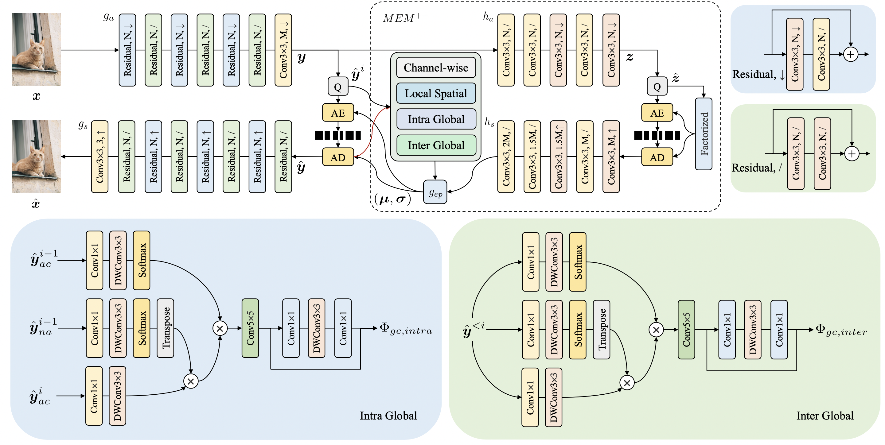

# MLIC Series [ACMMM 2023 / NCW ICML 2023]

This repo contains the official implementation of MLIC <sup> ++ </sup>. 

We highlight **MLIC <sup> ++ </sup>**, which **sloves the quadratic complexity of global context capturing**!

*MLIC: Multi-Reference Entropy Model for Learned Image Compression* [[Arxiv](https://arxiv.org/abs/2211.07273)] [[ACMDL](https://dl.acm.org/doi/10.1145/3581783.3611694)] is accepted at ACMMM 2023 !

*MLIC <sup> ++ </sup>: Linear Complexity Multi-Reference Entropy Modeling for Learned Image Compression*  [[Arxiv](https://arxiv.org/abs/2307.15421)] [[OpenReview](https://openreview.net/forum?id=hxIpcSoz2t)] is accepted at ICML 2023 Neural Compression Workshop !
- Compared with version presented at Neural Compression Workshop, ICML 2023 at OpenReview, in the latest arxiv version, we add the details of our prior work presented at ACMMM 2023, new comparisons on complexity and more ablation studies [Arxiv](https://arxiv.org/pdf/2307.15421.pdf).

For the versions of papers, we recommand the latest arxiv version.

<a href="https://star-history.com/#JiangWeibeta/MLIC&Date">
  
</a>

## Architectures




## Performance

Benchmark

|  | Kodak | Tecnick | CLIC Pro Valid |
|:--------:|:--------:|:------:|:--------:|
| VTM-17.0 Intra   | 0.00    |   0.00   | 0.00 | 
| STF (CVPR'22)  | -2.48    |   -2.75   | +0.42  | 
| WACNN (CVPR'22)   | -2.95    | - | +0.04   | 
| ELIC (CVPR'22)   | -5.95    |   -   |-|
| LIC-TCM Large (CVPR'23)   | -10.14    |   -11.47   |-8.04 |
| MLIC (ACMMM'23)   | -8.05    |  -12.73  |-8.79 |
| MLIC+ (ACMMM'23)  | -11.39    |   -16.38   |-12.56|
| MLIC++ (NCW ICML'23)   | -13.39    |   -17.59   |-13.08|

## Pretrained Models

#### Update 2024-04-08

I upload the training log when the lambda is 0.0250. The model is trained on 4 GPU cards with ddp support.

I fix the LatentResidualPrediction and SynthesisTransform, you should use LatentResidualPrediction and SynthesisTransform instead of LatentResidualPredictionOld and SynthesisTransformOld. The parameter number of **MLIC <sup> ++ </sup>** becomes 83.5M.
The modification leads to no performance drop.

Update checkpoint: https://disk.pku.edu.cn/link/AABED8912D2502477EB37C18FC7F2B2612

code: ujrv

#### Bug Fixes

I fix the implementation of *LinearGlobalIntraContext*.

New pre-trained models are available now. The performance is slightly better than before on Kodak and Tecnick.

#### Old Weights

To use old weights, you should use LatentResidualPredictionOld and SynthesisTransformOld.

<div class="center">

| Lambda | Metric | Link | Lambda | Metric | Link | 
|:--------:|:--------:|:------:|:--------:|:--------:|:------:|
| 0.0018   | MSE    |   [PKUDisk](https://disk.pku.edu.cn:443/link/56ABCF09A715A197523E5B8929DBA2BB), [GoogleDrive](https://drive.google.com/file/d/1rRdM5X5ueWvW5-ZN3gwPoXGECvgIcz-2/view?usp=drive_link)  |2.4 |MS-SSIM|[PKUDisk](https://disk.pku.edu.cn/link/4ADB5C181A5623D3A8252EACD86075E8), [GoogleDrive](https://drive.google.com/file/d/1ATugqZaT11oVvClNc5t7JogvX8ImQn95/view?usp=sharing) |
| 0.0035   | MSE    |   [PKUDisk](https://disk.pku.edu.cn:443/link/22775C0DBB903AC3A43342C8AFDBFD05), [GoogleDrive](https://drive.google.com/file/d/1SlIsurg4JocEBAWrnp1jiEe1EnFgw5AP/view?usp=drive_link)   |4.58|MS-SSIM|[PKUDisk](https://disk.pku.edu.cn:443/link/57A4BE18326D7C29DACFE18C9238872F), [GoogleDrive](https://drive.google.com/file/d/1jpPVJUT8xInZfZYPF8TLTXDzy2Su0sd2/view?usp=sharing) |
| 0.0067   | MSE    |   [PKUDisk](https://disk.pku.edu.cn:443/link/9474C67EE30DCCB3C77CDCC459425B38), [GoogleDrive](https://drive.google.com/file/d/1CKpyUXwifJZ9gb0l_Di6R-TMH9f4UmAU/view?usp=drive_link)   |8.73|MS-SSIM|[PKUDisk](https://disk.pku.edu.cn/link/6BA2E86861686F3F3E5F088BFEC2EC0B), [GoogleDrive](https://drive.google.com/file/d/1siIS3GJVylTmdanGBLt-fO_HqtZ5H4_Z/view?usp=sharing) |
| 0.0130   | MSE    |   [PKUDisk](https://disk.pku.edu.cn:443/link/59F4117444A787B253DE04D72C4AE2AB), [GoogleDrive](https://drive.google.com/file/d/1Qp4YBea3GkLSGDyYgo7OeaWZa5_rX8kJ/view?usp=drive_link)   |16.64|MS-SSIM|[PKUDisk](https://disk.pku.edu.cn/link/734D736F338080C9890618D7DDF7074E), [GoogleDrive](https://drive.google.com/file/d/11Ld5Xvbp52LeIHiAJbvgbHf9wnkylWfj/view?usp=sharing) |
| 0.0250   | MSE    |   [PKUDisk](https://disk.pku.edu.cn:443/link/00200D4B21E7428471DFF69C5B9878E5), [GoogleDrive](https://drive.google.com/file/d/1krGCTYat0Qkcp0QPaNC5sP3ofrq-eQsv/view?usp=drive_link)   |31.73|MS-SSIM|[PKUDisk](https://disk.pku.edu.cn/link/66DF324DACA64670FCB53EFE48BA31C5), [GoogleDrive](https://drive.google.com/file/d/1AZvQZWNQgKicCG0vtKgnjZ5b5Mwqklrs/view?usp=sharing) |
| 0.0483   | MSE    |   [PKUDisk](https://disk.pku.edu.cn:443/link/97112E78DC4F6D232A14FB1E4BD18260), [GoogleDrive](https://drive.google.com/file/d/1mIDwO_2Q1sNVriCFiLS1oxgfbVUaHihl/view?usp=drive_link)   |60.5|MS-SSIM| [PKUDisk](https://disk.pku.edu.cn/link/9C5D35615A1B6B6BF7ECA0BF45A043EC), [GoogleDrive](https://drive.google.com/file/d/1s39D48P_P6JB2CC33d5khlFTXZgOVlZo/view?usp=sharing) |

</div>

The structure of the provided weights is 
```
{
      "epoch": epoch + 1,
      "state_dict": net.state_dict(),
      "loss": loss,
      "optimizer": optimizer.state_dict(),
      "aux_optimizer": aux_optimizer.state_dict(),
      "lr_scheduler": lr_scheduler.state_dict(),
}
```

## Training

#### Settings

We train each model on a single Tesla A100 GPU. The batch size is set to $32$. The initial 
patch size is set to $256\times 256$. We set the patch size to $512\times 512$ after $1.2$ M steps.

#### Training Set

Training list is provided. These images are from DIV2K, Flicker2K, CLIC Train, COCO, ImageNet.
Most JPG images are downsampled and the downsampled images are stored in PNG format.
We use following function from PIL to downsample images.
```
img.resize((new_width, new_height), Image.ANTIALIAS)
```

#### Command

Example command is provided [Here](https://github.com/JiangWeibeta/MLIC/tree/main/MLIC%2B%2B/playground).

## Testing

Example command is provided [Here](https://github.com/JiangWeibeta/MLIC/tree/main/MLIC%2B%2B/playground).

## Environment

CompressAI 1.2.0b3

Pytorch 2.0.1

## Contact

If you have any questions about MLIC, please contact Wei Jiang ( wei.jiang1999@outlook.com or jiangwei@stu.pku.edu.cn )

## Citation
If you find our papers and this repo useful, kindly cite:

#### MLIC

```
@inproceedings{jiang2023mlic,
  title={MLIC: Multi-Reference Entropy Model for Learned Image Compression},
  author={Jiang, Wei and Yang, Jiayu and Zhai, Yongqi and Ning, Peirong and Gao, Feng and Wang, Ronggang},
  doi = {10.1145/3581783.3611694},
  booktitle={Proceedings of the 31st ACM International Conference on Multimedia},
  pages={7618--7627},
  year={2023}
}
```

#### MLIC <sup> ++ </sup>

```
@inproceedings{jiang2023mlicpp,
  title={MLIC++: Linear Complexity Multi-Reference Entropy Modeling for Learned Image Compression},
  author={Jiang, Wei and Wang, Ronggang},
  booktitle={ICML 2023 Workshop Neural Compression: From Information Theory to Applications},
  year={2023},
  url={https://openreview.net/forum?id=hxIpcSoz2t}
}
```
