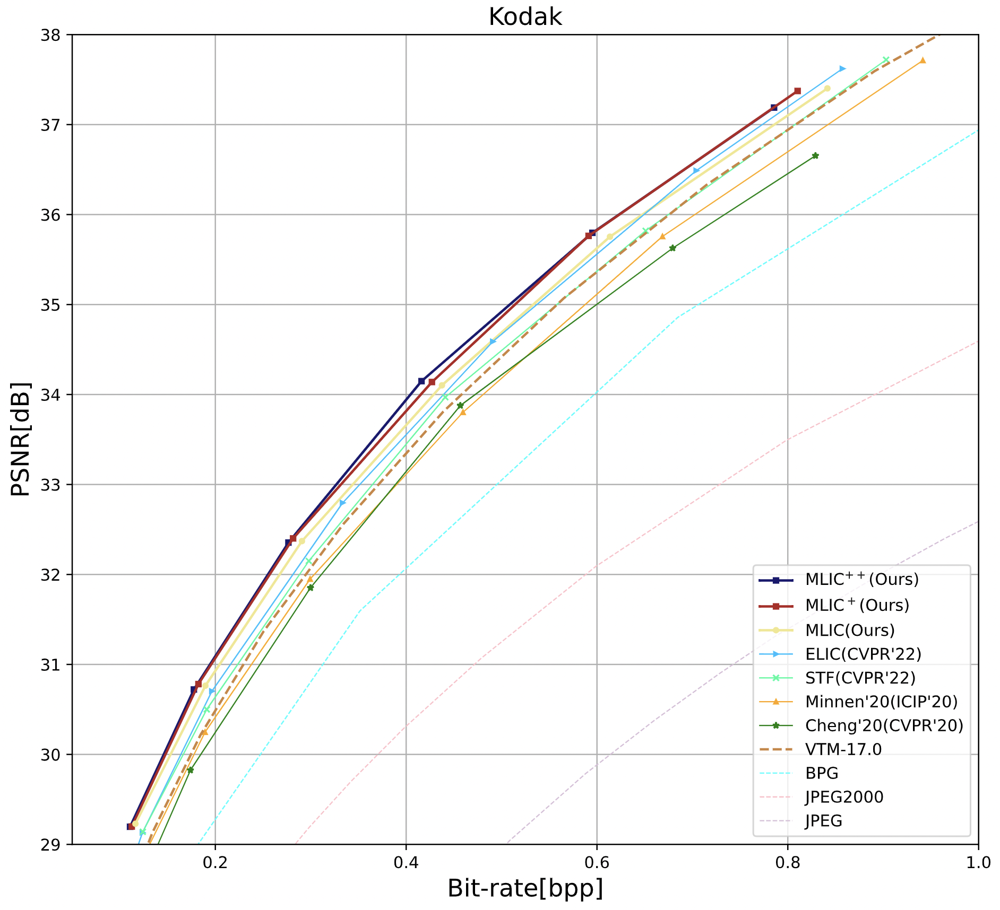
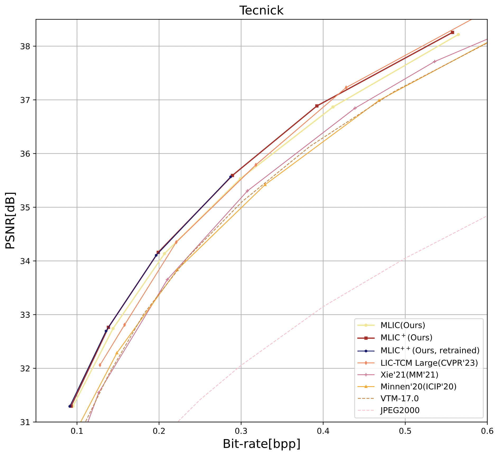
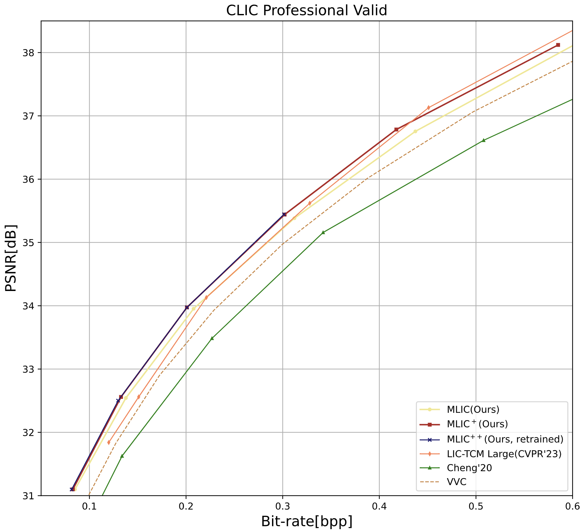

# MLIC Series [ACMMM 2023 / NCW ICML 2023]

Release the code of MLIC <sup> ++ </sup> ! 

We highlight **MLIC <sup> ++ </sup>**, which **sloves the quadratic complexity of global context capturing**!

*MLIC: Multi-Reference Entropy Model for Learned Image Compression* [[Arxiv](https://arxiv.org/abs/2211.07273)] is accepted at ACMMM 2023 !

*MLIC <sup> ++ </sup>: Linear Complexity Multi-Reference Entropy Modeling for Learned Image Compression*  [[Arxiv](https://arxiv.org/abs/2307.15421)] [[OpenReview](https://openreview.net/forum?id=hxIpcSoz2t)] is accepted at ICML 2023 Neural Compression Workshop !

## Bug Fixes

I fix the implementation of *LinearGlobalIntraContext*.

New pre-trained models will be released soon. The performance is slightly better than before on Kodak and Tecnick.

## Architectures


## Performance




## Pretrained Models

| Lambda | Metric | Link |
|--------|--------|------|
| 0.0018   | MSE    |   [PKUDisk](https://disk.pku.edu.cn:443/link/8C38E68C74F24D03FFE4E98C72C9C852)   |
| 0.0035   | MSE    |   [PKUDisk](https://disk.pku.edu.cn:443/link/8AA05395EB875D32EA9215C5337C6B18)   |
| 0.0067   | MSE    |   [PKUDisk](https://disk.pku.edu.cn:443/link/5F80E5132BEC0C042BBEA3A4FDE33076)   |
| 0.0130   | MSE    |   [PKUDisk](https://disk.pku.edu.cn:443/link/F6ED8F850DE2DEBCE930B0AB68B8D750)   |

## Environment

CompressAI 1.2.0b3

## Contact

If you have any questions about MLIC, please contact Wei Jiang ( wei.jiang1999@outlook.com or jiangwei@stu.pku.edu.cn )

## Citation
```
@article{jiang2022mlic,
  title={Multi-reference entropy model for learned image compression},
  author={Jiang, Wei and Yang, Jiayu and Zhai, Yongqi and Wang, Ronggang},
  journal={arXiv preprint arXiv:2211.07273},
  year={2022}
}
```

```
@article{jiang2023mlic,
  title={MLIC++: Linear Complexity Multi-Reference Entropy Modeling for Learned Image Compression}, 
  author={Jiang, Wei and Wang, Ronggang},
  journal={arXiv preprint arXiv:2307.15421},
  year={2023},
}
```
